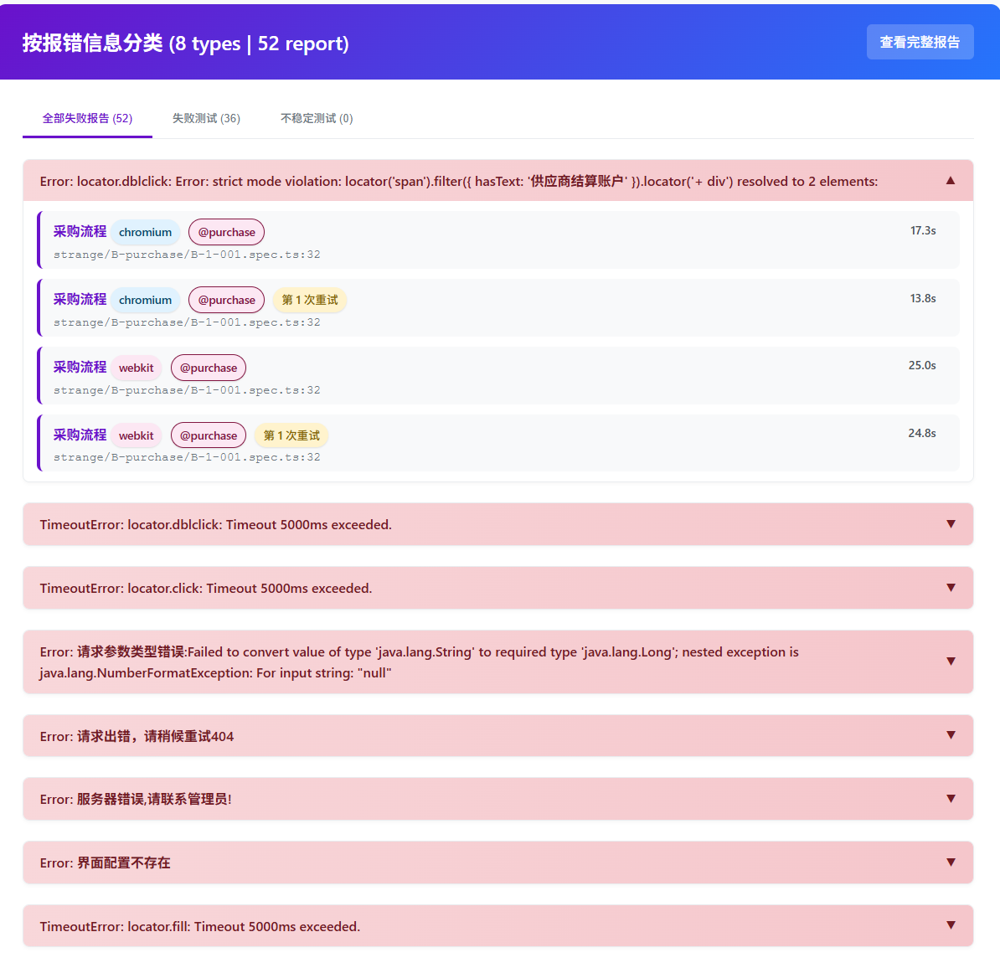

# Playwright Error Reporter

## 使用
1. 将`error-html-reporter.ts`文件复制到`playwright`项目根目录下，
2. playwright.config.ts下添加报告配置

```ts
	reporter: [
		["html"], // 官方html报告
		['./error-html-reporter.ts'], // 新增报错分类报告
	],
```
执行后会在`playwright-report`目录下生成`playwright-error-report.html`文件，打开即可查看

## 截图

